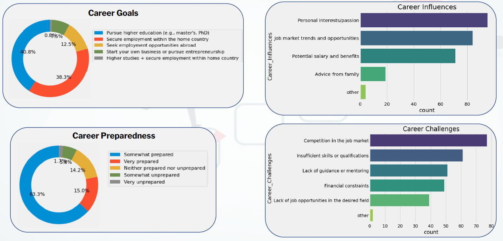
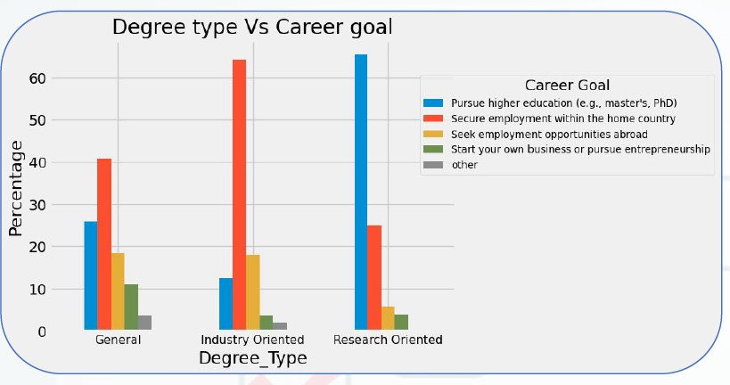
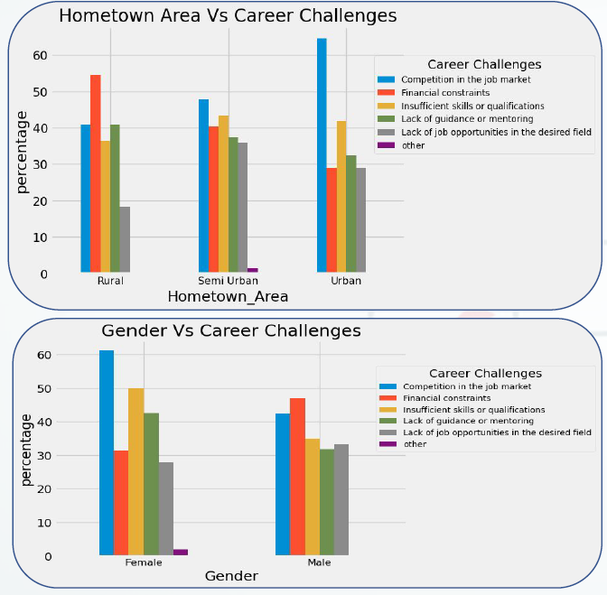

#  Career Aspirations & Preparedness Among Undergraduates

##  Overview
This project is a survey-based analysis of 3rd-year undergraduates in the Faculty of Science, University of Colombo. The study explores students' career goals, preparedness levels, influencing factors, and challenges faced when planning their future.

---

##  Objective
- Understand students’ career aspirations  
- Analyze factors influencing career decisions  
- Evaluate preparedness for future employment  
- Identify challenges faced by undergraduates  

---

##  Tools & Skills
- Python  
- Data Visualization  
- Survey Design  
- Pandas  
- Statistical Analysis  

---

##  Key Insights
-  Research-oriented students prefer higher studies, while others focus on local job opportunities  
-  Frequent knowledge-seeking improves career preparedness  
-  Female students face higher job market competition  
-  Male students report financial barriers  
-  Rural students benefit more from scholarships  
-  Urban students need better career guidance  

---

##  Conclusion
This study highlights how academic background, gender, and socio-economic factors influence career preparedness among undergraduates, helping identify areas where career guidance can be improved.

---

